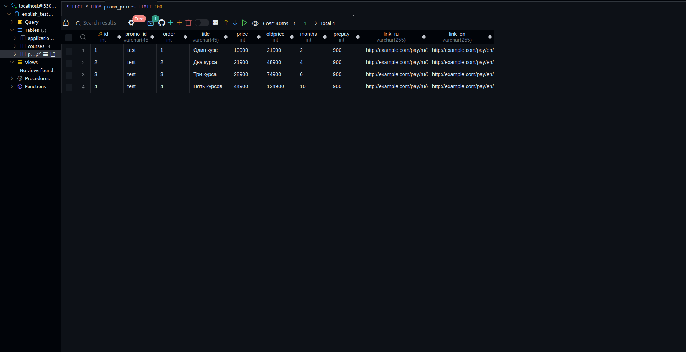
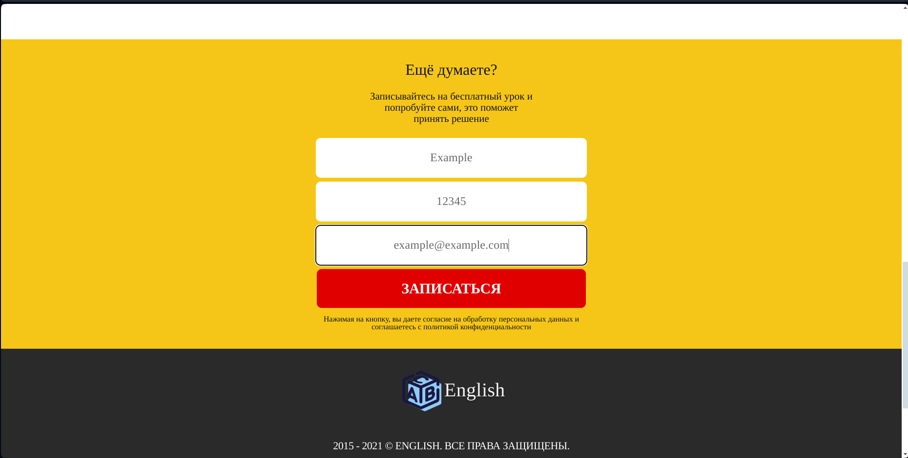

# Adaptation desktop-tablet-mobile with CSS example.

    
    
    

---

# GET promo prices from MySQL with PHP.

    
    
    

---

# POST client data request to MySQL with JS-PHP.

    
    

---

